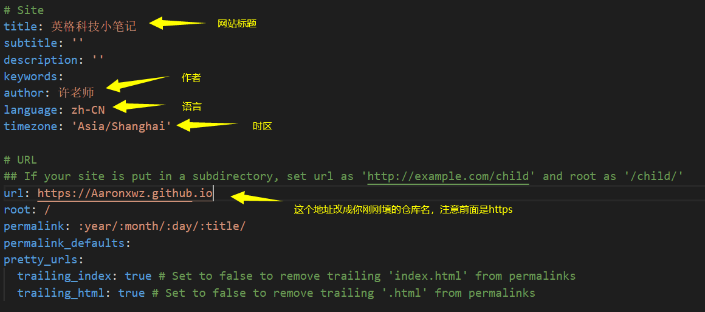
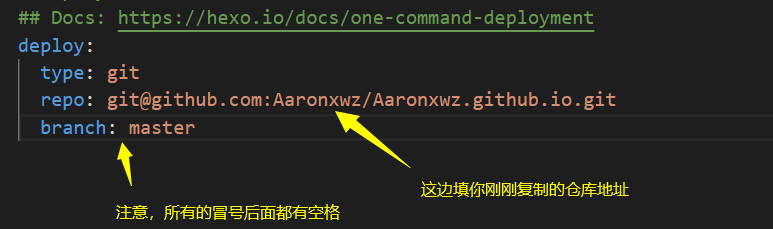
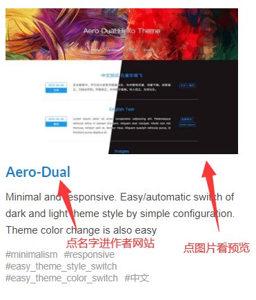
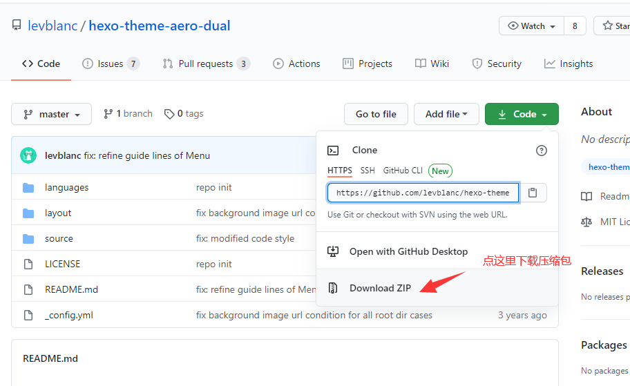
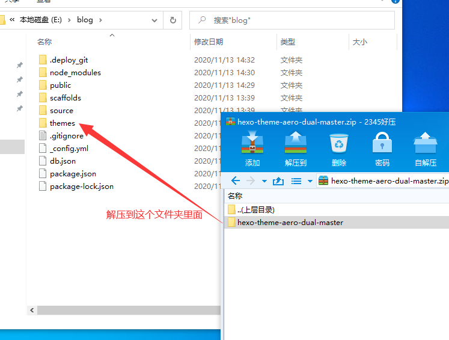
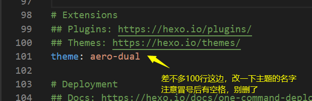

# 搭建 hexo  
## 准备工作  
1. https://github.com/ 账号一个，如果没有的话，自己用邮箱申请  
2. 最新版本node.js安装包，最新版本git安装包，都保持默认安装就行

## 初始化博客程序  
#### 依次输入以下命令  
    <
    npm install -g cnpm --registry=https://registry.npm.taobao.org          # 添加阿里巴巴的加速软件源
    cnpm install -g hexo                                                    # 安装本文主角hexo博客生成系统
    >  
#### 在电脑上找一个空的文件夹，这个以后就作为你的笔记网站的“根据地”了，别轻易改变位置，比如小编找的就是E盘下的blog文件夹，打开这个文件夹，然后在地址栏输入cmd之后回车，这次跳出来的黑框框有别之前的，各位小伙伴注意哦！  
    <
    hexo init       # 初始化博客系统，这步网速原因时间可能较长，请各位耐心等待
    hexo generate   # 生成博客的网页
    hexo server     # 开启博客本地测试服务器
    INFO  Hexo is running at http://localhost:4000 . Press Ctrl+C to stop.      # 运行成功后的最后一行
    >  
* 如果运行成功，各位小伙伴就可以打开自己电脑的浏览器，输入 http://localhost:4000 查看你的博客页面了，现在还比较原始，界面丑陋，而且英文，并且还只能在自己电脑上看  
* 我们先将其上传到github上面，让这个网站能够被全球所有人访问到，再说怎么美化和使用，首先打开各位同学电脑上刚刚安装的**Git bash**,然后输入如下命令，命令后面会有解释，但是你看不懂也没关系，照着敲就行(别把#号和解释也敲进去了啊！)  
    ```
    git config --global user.email "注册github用的邮箱填在这对引号里面"
    git config --global user.name "注册github用的用户名"
    ssh-keygen -t rsa -C "注册github用的邮箱填在这对引号里面" 
    # 生成登陆密钥，注意引号是英文的引号"而不是中文的引号“
    # 注意，这个命令回车后会出现好几个地方等你输入内容，直接回车即可
    cat `find /c/Users/ -name *.pub`
    # 注意空格哦，你看着像有空格的地方，其实都有空格
    # find前面pub后面的`符号，其实是键盘上Tab键上面的那个按钮
    # 这条命令敲完后，会显示一大堆乱码一样的东西，把这个复制下来，这个就是公钥
    ```  
* 把公匙粘贴到`Github`的`SSH and GPG`上去，随便取名字  
* 可以测试一下是不是成功，在gitbash中输入如下命令  
    ```
    ssh -T git@github.com           # 第一次运行这个命令，可能中途会停下来等待你输入一个yes
    ```  
* 在倒数第二行如果出现 **Hi "你的GitHub用户名"** 就说明成功了

* 接下点击左上角github的标志，然后开始创建仓库(Create repository)吧 
    ```
    注：你的仓库名一定是用户名后面加上 .github.io 不然后面会无法访问
    ``` 
* 复制仓库地址，然后开始修改我们的博客配置文件吧，博客的配置文件在之前创建的文件夹中的<u>_config.yml</u>(框架的配置)文件，推荐使用`vscode`或者`notepad++`打开，然后按照下图中黄色文字修改。 
  
  
* 下面开始上传你的网站到github上去吧，在你博客所在的文件夹地址栏里面输入cmd，然后输入如下命令  
    ```
    cnpm install hexo-deployer-git --save   # 安装自动上传到github的工具
    hexo clean      # 清理缓存
    hexo generate   # 生成博客网页
    hexo deploy     # 部署网页到github上面
    ```  
* 等待上传完成之后，就可以打开你的博客网页查看了，在浏览器直接输入你的仓库名，就是那个用户名.github.io的地址，现在你的网站已经可以被任何人访问了  
* 下面你可以去找个漂亮的主题给你的博客换上，hexo的官方主题网站 https://hexo.io/themes/  
* 你也可以找非官方的主题网站下载主题都可以，如何更换主题，在主题作者的网站上都会有详细的解释。这边举个例子，比如官方主题上的这个主题，首先点击名字，进入主题的作者页面  


  
* 记得解压之后，把文件夹的名字改简单点，方便后面使用  
* 然后修改那个网站的配置文件_config.yml  
 
* 然后重新生成和上传博客，然后刷新浏览器，就可以看到新的主题生效了   
    ```
    hexo clean      # 清理缓存
    hexo generate   # 生成博客网页
    hexo deploy     # 部署网页到github上面  
    # 其实可以写成这样 hexo clean && hexo g && hexo d
    ```
* 最后我们的网站做好了，至于具体怎么发表文章，怎么设置分类，篇幅有限，大家可以看hexo的官方文档 https://hexo.io/zh-cn/docs/writing
